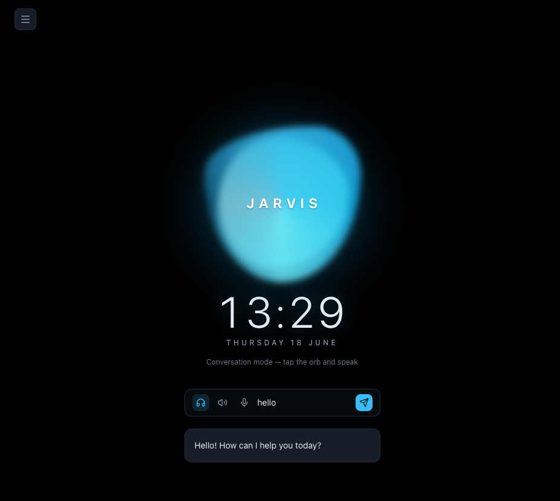
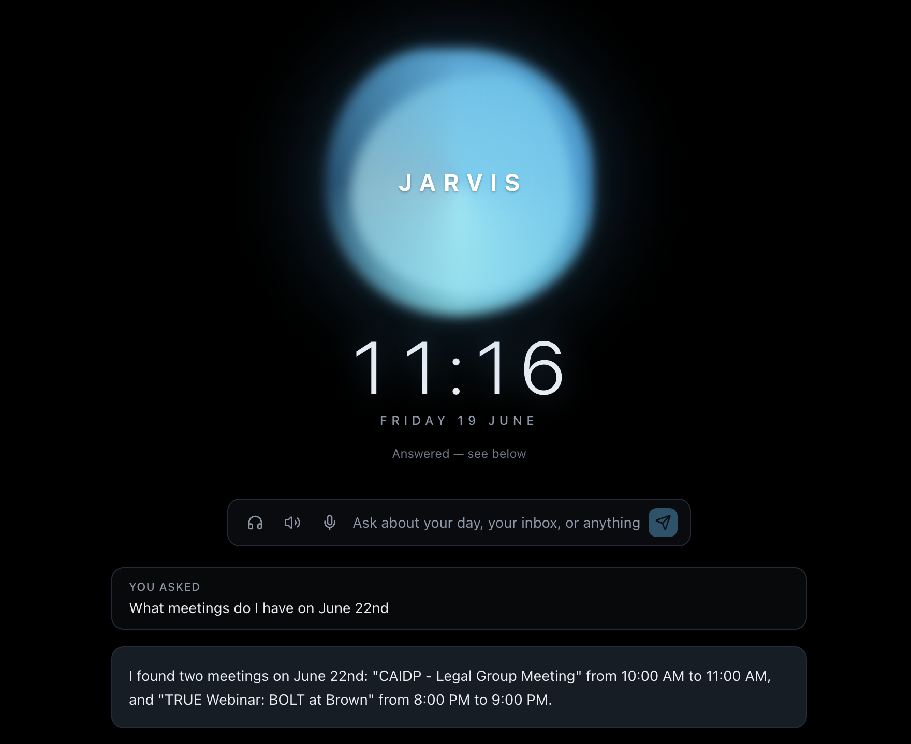
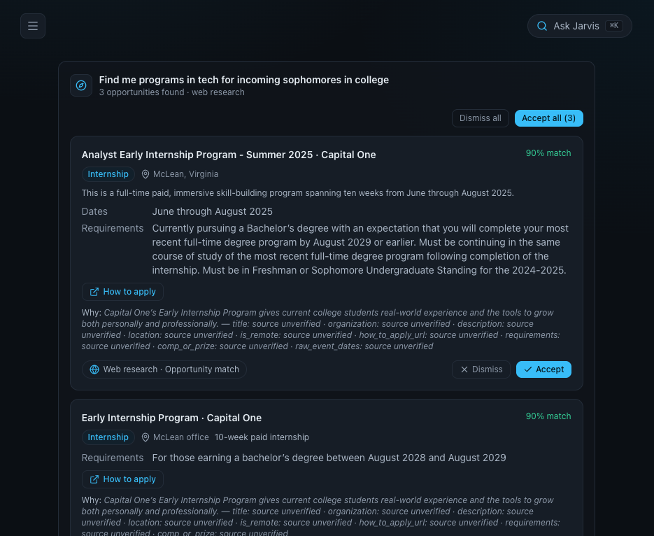

<p align="center">
  <svg xmlns="http://www.w3.org/2000/svg" width="84" height="84" viewBox="0 0 120 120">
    <circle cx="60" cy="60" r="56" fill="none" stroke="#0ea5e9" stroke-width="1.5" opacity="0.35" />
    <circle cx="60" cy="60" r="44" fill="none" stroke="#38bdf8" stroke-width="2.5" />
    <circle cx="60" cy="60" r="24" fill="#38bdf8" opacity="0.16" />
    <circle cx="60" cy="60" r="13" fill="#67e8f9" />
    <g stroke="#38bdf8" stroke-width="3" stroke-linecap="round">
      <line x1="60" y1="18" x2="60" y2="30" />
      <line x1="60" y1="90" x2="60" y2="102" />
      <line x1="18" y1="60" x2="30" y2="60" />
      <line x1="90" y1="60" x2="102" y2="60" />
    </g>
  </svg>
</p>

<h1 align="center">Jarvis</h1>

<p align="center">
  <strong>A personal command center that reads your email, meetings, and calendar, and turns commitments into tracked tasks and events — with a source link for every single one.</strong><br />
  Catches dropped threads, schedules from plain language, researches the people you owe, and answers out loud.
</p>

<p align="center">
  
  
</p>

<p align="center">
  
  
  
  
  
  
  
  
  
</p>

<p align="center">
  
</p>

---

Most "AI assistants" hand you a chat box and ask you to trust the answer. Jarvis is built on the
opposite bet: an assistant is only useful if you can **trust every item it creates**. So every task,
event, follow-up, and contact it derives carries a link back to the exact email line or transcript
moment that justified it — and nothing becomes "real" until you approve it. It reads your inbox and
meetings, proposes what to do next, and shows its receipts.

## What it does

<table>
  <tr>
    <td width="33%" valign="top">
      <h3>📥 Capture commitments</h3>
      A meeting says "get this in by July 29th" → a task with a real due date and a link straight to that line of the transcript.
    </td>
    <td width="33%" valign="top">
      <h3>🧵 Catch dropped threads</h3>
      Flags the important emails you never replied to and nudges you — reply-state verified from the actual thread, not guessed.
    </td>
    <td width="33%" valign="top">
      <h3>📅 Schedule from language</h3>
      "Let's meet Sunday" in an email becomes a proposed calendar event, with the date resolved deterministically — never hallucinated.
    </td>
  </tr>
  <tr>
    <td width="33%" valign="top">
      <h3>🤝 Track who you owe</h3>
      A contacts list of who to follow up with — web-researched background, why they matter to your goals, and an AI-drafted, personalized outreach email.
    </td>
    <td width="33%" valign="top">
      <h3>🧭 Find opportunities</h3>
      Ask in plain language for programs, jobs, or hackathons — Jarvis researches them on the web and tracks each with a real deadline.
    </td>
    <td width="33%" valign="top">
      <h3>🎙️ Talk to it</h3>
      A center orb you can ask out loud. It searches the web, reads your files, drafts emails, and answers back in a spoken voice.
    </td>
  </tr>
</table>

## Screenshots

<p align="center">
  
</p>

<p align="center">
  
</p>

<p align="center">
  
</p>

## Design

Near-black (`#0b0f14`) with one arc-reactor cyan (`#38bdf8`). At rest the home screen is just the
orb and the clock — the entire command center (Today, Email, Calendar, Meetings, Contacts,
Opportunities, Tasks, Goals, Review, Connections) lives behind a single hamburger, so nothing
competes with the orb until you ask for it. Every card is rendered by one `<Card>` primitive that
**refuses to render without a working source chip** — the trust rule is enforced in code, not by
convention.

## How it works

Jarvis is a pipeline from raw artifact → trusted, sourced item. Each step is deliberately split so
the language model is never trusted with a fact it could get wrong (a date, a number, "did I
reply?").

| Step | What happens | Built with |
|------|--------------|------------|
| **1 · Ingest** | Your email, meetings, and calendar are pulled in and stored as `sources` — raw text, when it occurred, and a permalink home. | Google Workspace OAuth (read-only scopes) |
| **2 · Extract** | Jarvis reads a source and proposes items (tasks, events, follow-ups) as **structured JSON via tool use** — never free text. | Gemini 2.5 Flash · tool-use / structured output |
| **3 · Resolve dates** | The model returns a *raw* phrase ("next Friday") + the quote; our code resolves the real timestamp against the source's date and your timezone. **The LLM never computes a date.** | chrono-node (deterministic) |
| **4 · Attach provenance** | Every derived item is stored with `source_id` + the **exact `source_quote`** + a `confidence` score. A DB-level `CHECK` rejects any AI row without it. | Supabase Postgres · `CHECK` + Row-Level Security |
| **5 · Review (L0)** | Suggestions land in a unified Review queue. Nothing becomes real until you approve it. | `review_feed` view (`security_invoker`) |
| **6 · Act** | Approved items become tasks/events; Jarvis drafts emails (**draft-only, never auto-sends**), creates calendar events, and saves templates. | Gmail compose + Calendar events scopes |
| **7 · Research** | Natural-language requests ("CS PMs at NYC startups", "summer fellowships") become web-researched people and opportunities — every claim's URL verified against real citations before it's saved. | Gemini agents + Tavily web search |
| **8 · Voice** | Ask the orb out loud; it runs the same loop and answers back in a spoken voice. | Web Speech API (in) + ElevenLabs (out) |

## Tech stack

| Layer | Tools |
|-------|-------|
| **Frontend** | Next.js 15 (App Router, Turbopack), React 19, Tailwind CSS v4 |
| **Language** | TypeScript 5 |
| **System of record** | Supabase — Postgres + Auth + Row-Level Security |
| **LLM** | Google Gemini 2.5 Flash — one tool-use loop powers the assistant, the extractor, and the research agents |
| **Web search** | Tavily (cohort + opportunity research; citations verified before persist) |
| **Date resolution** | chrono-node — deterministic, never the model |
| **Connectors** | Google Workspace — Gmail, Calendar, Drive, Sheets (narrowest OAuth scopes; tokens server-side only) |
| **People enrichment** | Apollo.io — find work emails + discover people (optional) |
| **Voice** | Web Speech API (speech-in) + ElevenLabs (speech-out) |
| **Icons** | lucide-react |

## APIs & services

Every external service Jarvis talks to, what it's for, and the env var(s) that enable it. Each
optional service is **gated on its key** — unset it and the feature simply doesn't appear; the rest
of the app keeps working.

| Service | What it does here | Env var(s) | Required? |
|---------|-------------------|-----------|-----------|
| **Supabase** | Postgres + Auth + Row-Level Security — the system of record | `NEXT_PUBLIC_SUPABASE_URL`, `NEXT_PUBLIC_SUPABASE_ANON_KEY` | **Yes** |
| **Google Gemini** | All runtime LLM calls — the assistant, the extractor, and the research/opportunity agents | `GEMINI_API_KEY` (+ `GEMINI_MODEL`) | **Yes** |
| **Google Workspace** | OAuth connector — Gmail (read), Calendar (read + create), Drive (read-only, draft-from-template), Sheets (contact import/export) | `GOOGLE_CLIENT_ID`, `GOOGLE_CLIENT_SECRET` (+ optional `GOOGLE_OAUTH_REDIRECT`) | For the email/calendar/meeting agents |
| **Tavily** | Web search the agents and the orb cite from (every quote traces to a real result URL) | `TAVILY_API_KEY` | Optional |
| **ElevenLabs** | Text-to-speech — gives the orb a spoken voice (`/api/voice`) | `ELEVENLABS_API_KEY` (+ `ELEVENLABS_VOICE_ID`, `ELEVENLABS_MODEL`) | Optional |
| **Apollo.io** | Find a contact's work email (enrich) + discover new people (search → email revealed on import) on the People page | `APOLLO_API_KEY` | Optional |
| **Web Speech API** | Browser speech-to-text for voice input | — (runs in the browser, no key) | Optional |

## The hard rules

These are enforced, not aspirational — the whole product depends on them ([`CLAUDE.md`](CLAUDE.md)):

- **Supabase Postgres is the system of record.** Notion is at most an optional one-way mirror, never the source of truth.
- **The LLM never computes dates, money, or reply-state.** Dates are resolved by chrono-node; reply-state is read from the actual thread.
- **Every derived item stores `source_id` + `source_quote` + `confidence`.** No exceptions — guarded at the database.
- **No card renders without a working source chip.** Enforced by the `<Card>` primitive.
- **Suggest-only first (Autonomy L0).** Derived items wait in Review; you approve before anything is real.
- **Narrowest OAuth scopes; tokens server-side only.** Read-only first; RLS keeps every row user-scoped.

## Data model

The provenance core — every derived `item` points back to the `source` that justified it:

```sql
-- the original artifacts we ingested
create table sources (
  id          uuid primary key default gen_random_uuid(),
  user_id     uuid references auth.users not null,
  source_type text not null,        -- 'email' | 'meeting' | 'calendar' | 'research' | 'manual'
  permalink   text,                 -- deep link back to the original
  occurred_at timestamptz,          -- when the email/meeting happened (the date anchor)
  raw_text    text                  -- body/transcript, for re-extraction
);

-- everything Jarvis derives, with a trail home
create table items (
  id           uuid primary key default gen_random_uuid(),
  user_id      uuid references auth.users not null,
  item_type    text not null,       -- 'task' | 'event' | 'follow_up' | 'app_status' | 'outreach'
  title        text not null,
  due_at       timestamptz,         -- RESOLVED by chrono-node, never raw
  status       text default 'review', -- 'review' | 'accepted' | 'done' | 'dismissed'
  confidence   numeric,             -- 0..1 from the extractor
  source_id    uuid references sources,  -- WHERE it came from
  source_quote text                 -- the EXACT line that justified it
);
```

Plus `contacts`, `contact_channels`, `connections`, `email_templates`, `goals`, `contact_goals`,
`research_runs`, `opportunities`, `opportunity_runs`, `goal_links`, `connected_accounts`, and
`profiles` — all RLS-scoped to the owning user, all migrations in [`supabase/migrations/`](supabase/migrations/).
AI-created `contacts` and `opportunities` carry a DB-level provenance `CHECK` that mirrors the
`<Card>` invariant.

## Running it locally

```bash
git clone https://github.com/aaravmin/Jarvis.git
cd Jarvis
npm install

cp .env.example .env.local      # then fill in the keys below
npm run dev                     # http://localhost:3000
```

Environment (`.env.local`, gitignored — never commit it):

```bash
NEXT_PUBLIC_SUPABASE_URL=         # Supabase → Project Settings → API
NEXT_PUBLIC_SUPABASE_ANON_KEY=    # the public anon key (RLS still applies)
NEXT_PUBLIC_SITE_URL=             # app base URL (default http://localhost:3000) — used for the OAuth redirect
GEMINI_API_KEY=                   # the assistant, extractor, and research agents
TAVILY_API_KEY=                   # web search for the research agents
GOOGLE_CLIENT_ID=                 # Gmail / Calendar / Drive / Sheets connector
GOOGLE_CLIENT_SECRET=
GOOGLE_OAUTH_REDIRECT=            # optional — defaults to ${NEXT_PUBLIC_SITE_URL}/api/connect/google/callback
ELEVENLABS_API_KEY=               # optional — gives Jarvis a spoken voice
APOLLO_API_KEY=                   # optional — find work emails + discover people
```

See [APIs & services](#apis--services) above for the full list and what each key unlocks.

Then apply the schema by running the files in [`supabase/migrations/`](supabase/migrations/) (`0001`
→ latest) in the Supabase SQL editor. Connect Google from the in-app **Connections** tab to unlock
the email, calendar, and contacts agents.

## Project structure

```
src/app/                  # Next.js App Router
  page.tsx                # → redirects to the orb (/jarvis)
  (app)/                  # the signed-in command center (server-side auth gate)
    jarvis/  today/  email/  calendar/  meetings/  people/
    opportunities/  tasks/  goals/  review/  templates/  connections/
  api/                    # route handlers: ask, agent, research, opportunities,
                          #   google/*, contacts, templates, goals, voice …
src/components/           # JarvisOrb / JarvisSphere, Card (the source-chip gate),
                          #   SourceChip, PersonCard, OpportunityCard, NavDrawer …
src/lib/
  assistant/              # the orb's tool-use loop, write-actions, prompts
  agents/                 # multi-agent router (people + opportunity research)
  llm/                    # Gemini tool-loop client
  research/               # cohort research + citation verification
  google/                 # OAuth, Gmail, Calendar, Drive, Sheets
  templates/              # email template store
  voice/                  # ElevenLabs TTS
  supabase/               # SSR + middleware clients
docs/                     # PRD, ROADMAP, DATA_MODEL, DECISIONS, PROGRESS
supabase/migrations/      # 0001 → latest — run in the Supabase SQL editor
```

<p align="center">
  <sub>Built by Aarav Minocha · provenance-first, suggest-only by default · see <a href="docs/PRD.md">docs/PRD.md</a> and <a href="docs/ROADMAP.md">docs/ROADMAP.md</a></sub>
</p>
