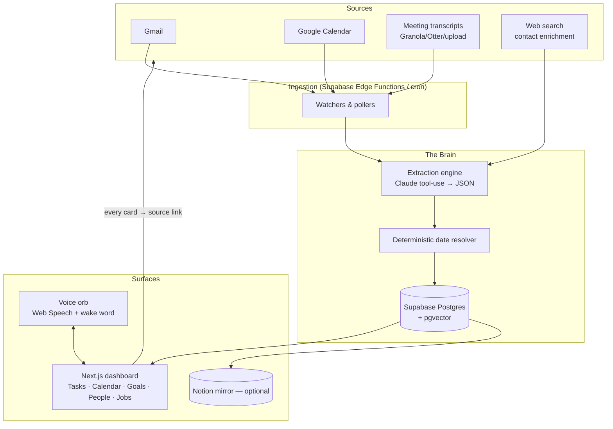

# Otto — Your Personal Command Center
### Product roadmap + Claude Code build plan

Adhere to a Research-First approach: thoroughly analyze the requirements and explore existing code before using any tool. Avoid speculative execution or large sweeping changes. Use Reasoning Loops to map out edge cases. Never reason from assumptions; verify every step against actual data. Provide clear, concise explanations for your actions.
**Built for:** a job-seeker / knowledge worker who wants one place that tracks job applications, email, meetings, calendar, and goals — and *proactively* tells them what to follow up on, with a clear trail back to where every item came from.

**Assumptions I'm making (change these if wrong):**
- You're on **macOS** (most "Otto" voice/desktop tooling and meeting capture is Mac-first today; Windows notes are flagged where they matter).
- Your email/calendar live in **Google (Gmail + Google Calendar)**. If you're on Outlook/Microsoft 365, the *shape* of the plan is identical — only the connector changes.
- You're an **intermediate builder**: comfortable running commands and reading code, leaning on Claude Code to do the heavy lifting.
- You'll build this **in Claude Code, one task at a time**, exactly as you described.

> **How to use this doc:** Sections 1–4 are the *thinking* (read once). Section 5 is the *roadmap* — the part you actually feed Claude Code. Section 7 gives you copy-paste prompts to start today. Keep this file in your repo at `/docs/ROADMAP.md` so Claude Code can read it every session.

---

## 1. Market research — what already exists, and where your wedge is

I looked at the tools that already do pieces of what you want. The pattern is consistent and it tells you exactly where to aim.

### 1.1 Meeting notes → action items
Granola, Fireflies, Otter, Fathom, Fellow, and others all record/transcribe and produce "summaries with action items." The honest reviews in 2026 agree on one thing: **transcription is now a commodity** (Zoom, Meet, and Teams give summaries away for free), and the *real* unsolved problem is what happens **after** the meeting — action items get captured but **don't move anywhere**. The tools that win in 2026 are the ones that "close the loop" (draft the follow-up, push the task somewhere it'll actually get done). Notable: Granola runs **bot-free**, capturing system audio locally on a Mac; Fireflies has pushed into "voice agents" that auto-push structured data to Notion/Slack.

**Takeaway for you:** transcription isn't your product. *Turning "let's get this in by July 29th" into a tracked, sourced task that lands in your one dashboard* is.

### 1.2 Email triage → follow-up
Superhuman (now under Grammarly) and Shortwave are the leaders. Superhuman has "Auto Reminders" that detect when you owe a follow-up; Shortwave does AI search/bundling/drafts. But the sharpest reviews call out a shared limitation: **they make you faster at processing email — they don't remove the judgment layer.** You still read every message, still decide what's a task, still manually create the task, still handle the "can we meet Sunday?" calendar request by hand. The one tool explicitly trying to cross that line (alfred_) markets itself as the *only* one that triages **and** extracts tasks from threads **and** delivers a morning brief.

**Takeaway for you:** the frontier is the **judgment + extraction** layer (email → task / follow-up / calendar event, automatically). That's precisely your spec.

### 1.3 Calendar / scheduling
Two philosophies: **Motion** is *prescriptive* — you give it tasks with deadlines and it builds (and rebuilds) your whole day. **Reclaim** is *defensive* — it protects focus blocks and habits and time-blocks tasks synced from other tools. (Motion has even rebranded around "AI Employees," one literally named *Alfred*.) Neither is a unified system-of-record that pulls from email + meetings + your goals with provenance.

**Takeaway for you:** you don't need to out-schedule Motion. You need to be the **layer above** — the thing that *decides what becomes a task/event in the first place* and shows you everything in one view.

### 1.4 Job-application trackers
Huntr and Teal are the leaders (Kanban "command center" + AI resume tailoring + autofill extensions). Critically: their Gmail integrations **detect** application emails but **keep a human in the loop on every state change** — you still confirm and drag each card. Someone has already publicly built (and written up) a Claude-tool-use system that reads Gmail and tracks every application *automatically* — proving the approach works and that the gap is real.

**Takeaway for you:** a job-tracker module is achievable and differentiated *if* it (a) auto-detects from email, (b) shows provenance, and (c) graduates from "suggested" to "automatic" as you trust it.

### 1.5 "Otto" voice assistants
There are dozens of open-source voice assistant projects. The most relevant to you is **Julian-Ivanov/jarvis-voice-assistant** — *built entirely with Claude Code, no code written by hand* — with this architecture: **browser Web Speech API (voice in) → local FastAPI server → Claude (the brain) → ElevenLabs (voice out) + Playwright (browser control) + screenshot → Claude Vision (sees your screen)**, triggered by a double-clap. That's a working blueprint for your "circle in the middle, talk to it, it does things" layer. Most other Jarvis repos are Python + a wake-word library (Picovoice/Porcupine) + speech-to-text + text-to-speech + app automation.

**Takeaway for you:** the voice + computer-control piece is real and has a proven pattern — but it's a **separate subsystem** from your dashboard, and the "control my computer" part ranges from easy (browser automation) to genuinely hard/risky (full OS control). Sequence it late.

### 1.6 The synthesis — your actual wedge
Every category above has strong single-purpose tools, and they all stop at the same wall: **they hand the judgment back to you, they live in their own silo, and they don't tell you *why* they did what they did.**

Your three differentiators, in priority order:
1. **Unification** — email, meetings, calendar, goals, and job apps in *one* view. (Nobody owns this for an individual.)
2. **Provenance** — every task/reminder/event links back to the exact email line or transcript moment that created it. This is your trust mechanism *and* your headline feature ("it tells me exactly where it got that").
3. **Earned autonomy** — start by *proposing* ("I think this is a task — approve?"), and graduate high-confidence items to *automatic*. Provenance is what makes autonomy safe.

That's the whole product thesis. Build for those three and you're not competing with Superhuman or Motion — you're the layer that sits above them.

---

## 2. Product definition (specific to you)

**One-line:** *A personal command center that reads your email, meetings, and calendar, turns commitments into tracked tasks and events with a source link for each, and proactively surfaces what to follow up on — controllable by voice.*

**The six jobs it does for you:**
1. **Capture commitments** from meetings ("get this in by July 29th") → a task with a due date and a link to the transcript moment.
2. **Catch dropped threads** — flag important emails you haven't replied to and nudge you.
3. **Schedule from language** — "let's meet Sunday" in an email → a proposed calendar event (date resolved correctly, not hallucinated).
4. **Track the people you owe** — a contacts list of who to follow up with: their contact info auto-researched from the web, why they matter to your goals, what you need from them, how you know them, and a notes field (where the AI flags anything it isn't sure about) — with AI-drafted, personalized outreach.
5. **Unify the view** — one dashboard for tasks, calendar, goals, **people**, and **job applications**, each item showing its source.
6. **Respond to voice** — a center "orb," wake-word/voice activation, talk to it, it acts.

**Non-negotiable feature (do this from day one):** every derived item stores `source_type`, `source_id`, a `source_url`/permalink, the **exact extracted quote**, and a `confidence` score. The UI shows a "source" chip on every card that opens the original with the quote highlighted. If you only ship one thing well, ship this.

**The autonomy ladder (how trust is earned):**
- **L0 – Suggest:** everything lands in a "Review" queue; you approve/reject. (Start here.)
- **L1 – Auto-high-confidence:** items above a confidence threshold auto-apply; you can undo. Low-confidence stays in Review.
- **L2 – Auto with daily digest:** it acts, and tells you what it did each morning. You intervene by exception.

Ship L0. Move up only when the false-positive rate is low *for you*.

---

## 3. Architecture & stack (with honest changes to your assumptions)

You proposed **Notion API + React/Next + Supabase**. React/Next and Supabase are great picks. The one change I'd push back on:

### 3.1 The big decision — **Notion is a view, not the brain**
Notion's API has hard limits that make it a poor *system of record* for something that ingests data all day:
- **Rate limit ~3 requests/second** per integration.
- **~1,000-block ceiling per page** and block-level writes are slow (a 50-block page ≈ 50 API calls ≈ ~17 seconds).
- It was built for team docs, **not programmatic data ingestion** — multiple engineers writing in 2026 explicitly conclude "personal life-logging needs a real database; Notion is not one," and recommend Postgres/Supabase as the store with **~167× the throughput**.

**Recommendation:** make **Supabase (Postgres) your system of record** — the brain. Treat **Notion as an optional, one-way mirror** ("push my tasks/applications into a Notion board so I can see them there too") if and only if you specifically want to live in Notion. Don't put core logic on the Notion API. This is the single most important architecture call in this doc, and it's why I'm flagging it before you write a line of code.

### 3.2 Recommended stack
| Layer | Choice | Why |
|---|---|---|
| **Frontend** | Next.js (App Router) + React + Tailwind | Your pick; great for the dashboard + the voice orb. |
| **System of record** | **Supabase**: Postgres + Auth + Row-Level Security + Realtime + Edge Functions (Deno) + **pgvector** | One service covers DB, auth, live updates, serverless jobs, and embeddings for semantic search. |
| **Extraction engine** | **Claude API** with **tool use / structured output** | Turns raw email/transcript text into validated JSON (tasks, events, follow-ups) with the source quote. |
| **Connectors** | **Model Context Protocol (MCP)** servers — Google Workspace (Gmail + Calendar + Drive), Notion | Claude Code natively speaks MCP. Lets the assistant read/write your real apps. |
| **Voice** | Web Speech API (in-browser STT, free) → upgrade to Whisper / a realtime voice API; ElevenLabs or browser TTS; **Picovoice/Porcupine** for the wake word | Proven by the Claude-Code Jarvis blueprint. |
| **Computer control (late)** | Playwright (browser automation) → optional Tauri/Electron desktop shell + Claude computer-use for OS control | Browser automation is the realistic 80%. Full OS control is advanced + risky. |
| **Scheduler/worker** | Supabase scheduled Edge Functions (cron) for polling/ingestion | Keeps ingestion server-side and reliable. |

**A note on MCP + Claude Code:** the Google Workspace MCP server covers Gmail, Calendar, Drive, and Docs through one OAuth setup (a Google Cloud project). Heads-up: Anthropic's *cloud* Gmail/Calendar connectors don't support local OAuth from Claude Code (their redirect URL is registered to claude.ai), so for a programmatic/headless build you'll use a community or self-hosted Google-OAuth MCP server, not the built-in cloud connector. Claude Code also has a **headless mode** so the same workflows can run on a schedule.

### 3.3 System diagram



### 3.4 The provenance data model (the core — get this right first)
Every *derived* object (task, event, follow-up, application-status change) is **never trusted on its own** — it carries a `source` record. Minimal schema:

```sql
-- the original artifacts we ingested
create table sources (
  id uuid primary key default gen_random_uuid(),
  user_id uuid references auth.users not null,
  source_type text not null,         -- 'email' | 'meeting' | 'calendar' | 'manual'
  external_id text,                  -- gmail message id, transcript id, gcal event id
  permalink text,                    -- deep link back to the original
  title text,                        -- e.g. email subject / meeting name
  occurred_at timestamptz,           -- when the email/meeting happened
  raw_text text,                     -- transcript or email body (for re-extraction)
  created_at timestamptz default now()
);

-- everything Jarvis derives, with a trail home
create table items (
  id uuid primary key default gen_random_uuid(),
  user_id uuid references auth.users not null,
  item_type text not null,           -- 'task' | 'event' | 'follow_up' | 'app_status'
  title text not null,
  due_at timestamptz,                -- resolved, not raw
  status text default 'review',      -- 'review' | 'accepted' | 'done' | 'dismissed'
  confidence numeric,                -- 0..1 from the extractor
  source_id uuid references sources, -- WHERE it came from
  source_quote text,                 -- the EXACT line that justified it
  reasoning text,                    -- one sentence: why Jarvis created this
  created_by text default 'jarvis',  -- 'jarvis' | 'user'
  created_at timestamptz default now()
);
```
The UI rule: **no card renders without a working "source" chip.** Tapping it opens `permalink` (or shows `raw_text` with `source_quote` highlighted). That single rule is your "tells me exactly where it got that" feature.

### 3.5 The extraction engine — and the one trap to avoid
Feed Claude an email/transcript and ask for **structured JSON only**:
```json
{
  "is_actionable": true,
  "tasks": [{"title": "Submit the grant draft", "raw_due": "by July 29th",
             "source_quote": "let's get this in by July 29th", "confidence": 0.9}],
  "meeting_requests": [{"raw_when": "Sunday", "source_quote": "let's meet on Sunday",
                        "confidence": 0.8}],
  "follow_up_needed": true,
  "follow_up_reason": "they asked a question you haven't answered"
}
```
**The trap:** do **not** let the LLM do date math. "Sunday" or "next Thursday" must be resolved **deterministically** against the *source's* `occurred_at` and *your* timezone using a real date parser (e.g., `chrono-node`), not the model's arithmetic. LLMs silently get "next Sunday" wrong; a parser doesn't. So the model returns `raw_due`/`raw_when` strings + the quote; your code resolves them into `due_at`. This is the difference between a toy and something you'll trust.

### 3.6 Real-time vs. polling
Start with **scheduled polling** (a cron Edge Function every ~5 min using Gmail's History API `historyId` and Calendar **sync tokens**). It's simple and robust. Upgrade to **push** later (Gmail `users.watch` + Google Cloud Pub/Sub → webhook; Calendar watch channels) once the basics work. Don't start with push — it adds infra you don't need on day one.

### 3.7 People, connections & templates (the contacts + outreach layer)
Contacts are a *primary* entity (not derived), so they get their own tables. The AI-drafting tool reuses the **same Claude integration as the extraction engine (3.5)** — only the prompt changes. Schema:

```sql
-- people you track and follow up with
create table contacts (
  id uuid primary key default gen_random_uuid(),
  user_id uuid references auth.users not null,
  full_name text not null,            -- the only field you must enter (or auto-captured from email/meetings)
  company text,
  role_title text,                 -- the job they have (used to tailor outreach)
  background text,                 -- who they are (factual bio; AI-enriched from the web)
  relevance text,                  -- WHY they matter to you (AI links this to your goals)
  the_ask text,                    -- WHAT you need from them (AI-proposed)
  notes text,                      -- freeform notes; AI writes caveats here when it isn't sure
  follow_up_status text default 'to_reach_out',  -- 'to_reach_out' | 'waiting' | 'done'
  next_follow_up_at timestamptz,
  field_sources jsonb,             -- per-field provenance: {"email": {"url":"…","confidence":0.6}}
  source_id uuid references sources,  -- set if auto-created from an email/meeting (provenance)
  created_by text default 'user',     -- 'user' | 'jarvis'
  created_at timestamptz default now()
);

-- flexible contact methods: email, linkedin, phone, x, website, "whatever it is"
create table contact_channels (
  id uuid primary key default gen_random_uuid(),
  contact_id uuid references contacts on delete cascade not null,
  kind text not null,              -- 'email' | 'linkedin' | 'phone' | 'x' | 'website' | 'other'
  value text not null,
  is_primary boolean default false
);

-- how you know them — this is what Claude weaves into the email
create table connections (
  id uuid primary key default gen_random_uuid(),
  contact_id uuid references contacts on delete cascade not null,
  relationship_note text,          -- "friend of a friend via Sarah", "met at the X conf"
  introduced_by uuid references contacts  -- optional structured link to a mutual contact
);

-- reusable email templates with placeholders
create table email_templates (
  id uuid primary key default gen_random_uuid(),
  user_id uuid references auth.users not null,
  name text not null,
  subject text,
  body text not null               -- supports {{first_name}}, {{company}}, {{role}}, {{connection}}
);

-- let tasks / follow-ups / outreach attach to a person (reuses the items table from 3.4)
alter table items add column contact_id uuid references contacts;

-- your goals (the table behind the Goals tab from P1-T2)
create table goals (
  id uuid primary key default gen_random_uuid(),
  user_id uuid references auth.users not null,
  title text not null,             -- "work in big tech", "work in tech for social good"
  description text,
  created_at timestamptz default now()
);

-- which goal(s) a contact advances, and why (AI-proposed, you approve)
create table contact_goals (
  id uuid primary key default gen_random_uuid(),
  contact_id uuid references contacts on delete cascade not null,
  goal_id uuid references goals on delete cascade not null,
  rationale text,                  -- "PM at Microsoft → your 'big tech' goal"
  confidence numeric               -- 0..1; the link can be non-obvious
);
```
**The AI-draft flow (task P6-T5):** the request to *your* Claude API gets (1) the contact's `background` + `role_title` + `company`, (2) the chosen template body, and (3) any `relationship_note` you typed or already have on file. Claude fills the placeholders **and** tailors tone and content to that person and the job they have, working the connection in naturally ("Sarah suggested I reach out…"). The draft returns fully editable, and the UI shows exactly which template, fields, and connection note were used - so, like everything else in Otto, you can see where it came from.

**The enrichment flow (tasks P6-T8 / P6-T9):** seed a contact with **just a name** (e.g., "Christopher Edley") and the AI calls your Claude API **with web search** to fill `background`, `company`, `role_title`, and `contact_channels`, storing a **source URL + confidence per field** in `field_sources`. When it can't confirm something - or several people share the name - it writes a plain-language caveat into `notes` ("couldn't verify this email; multiple people match this name - confirm before sending") instead of pretending to be sure. Then, given your **goals from the Goals tab**, it proposes `relevance`, `the_ask`, and one or more `contact_goals` links each with a rationale - including non-obvious ones (a "tech for social good" role → your social-good goal; a Microsoft PM → your "big tech" goal). You confirm or edit everything; **nothing about a person is treated as fact just because the AI wrote it** - that's the whole point of `field_sources`, `confidence`, and the notes caveats.

---

## 4. The Claude Code operating method — your anti-hallucination system

This is the part you specifically asked for: a way to work task-by-task so you can **cut a session, get context, and resume in a fresh session with no drift or hallucination.** Here's the method, and *why* it works.

### 4.1 Why small tasks = no hallucination
Hallucination and "it forgot what we decided" in long Claude Code sessions come from one root cause: **the model relying on a giant, decaying chat context instead of on durable, written state.** The fix is structural, not magical:
- **Keep state in files, not in the chat.** The repo *is* the memory. If it's not written down (in code, in `/docs`, in `PROGRESS.md`), it doesn't exist.
- **One task per session.** Atomic tasks finish before context bloats. A finished, committed task is a checkpoint that can't drift.
- **Every session starts by reading the same files** and ends by updating them. The chat is disposable; the files are the truth.

### 4.2 Repo doc structure (create this in Phase 0)
```
/CLAUDE.md                 # how to work in this repo (rules, conventions, stack, what NOT to do)
/docs/
  ROADMAP.md               # THIS file
  PRD.md                   # the product definition (Section 2)
  DATA_MODEL.md            # the schema (Sections 3.4 & 3.7) + every change to it
  DECISIONS.md             # append-only log: date, decision, why (e.g. "Notion = view not brain")
  PROGRESS.md              # living state: phase, last task done, what's next, known issues
  SESSION_HANDOFF.md       # regenerated at the end of each session (see 4.4)
```
`CLAUDE.md` is read automatically by Claude Code every session — put your hard rules there (e.g., *"Supabase is the system of record. Never store core data in Notion. Never let the LLM compute dates. Every derived item must have a source_id and source_quote."*).

### 4.3 The task spec template (use this for every task in Section 5)
```
TASK ID: P2-T3
TITLE: Email → task extraction with provenance
GOAL: One sentence on what "done" delivers to the user.
CONTEXT TO READ FIRST: /docs/PRD.md, /docs/DATA_MODEL.md, /docs/PROGRESS.md
SCOPE (do exactly this): bullet list, small.
OUT OF SCOPE (do NOT touch): bullet list — protects you from scope creep.
ACCEPTANCE CRITERIA (Definition of Done):
  - [ ] testable check 1
  - [ ] testable check 2
  - [ ] provenance: every created item has source_id + source_quote
VERIFY BY: the exact command/click that proves it works.
ON FINISH: update /docs/PROGRESS.md, append any decision to /docs/DECISIONS.md, commit.
```
Atomic + testable + explicit out-of-scope = a session that finishes clean.

### 4.4 Session handoff protocol (copy-paste prompts)
**At the END of every session**, paste this:
> "We're wrapping this session. 1) Update `/docs/PROGRESS.md` with: current phase, the task we just finished (ID + what changed), what's verified working, and the exact next task. 2) Append any non-obvious decision we made to `/docs/DECISIONS.md` with a one-line rationale. 3) Write `/docs/SESSION_HANDOFF.md` as a fresh-start brief for a new session that has zero memory of this chat: what the project is, current state, what files matter, and the single next task with its acceptance criteria. Do not summarize the whole codebase — point to files. Then commit everything with a clear message."

**At the START of a new session**, paste this:
> "Read `/CLAUDE.md`, `/docs/SESSION_HANDOFF.md`, and `/docs/PROGRESS.md`. Confirm in 3 bullets: (a) what state the project is in, (b) the single next task, (c) the acceptance criteria for it. Do not write code until I confirm. If anything in those files is ambiguous or contradicts what you see in the repo, ask me before proceeding."

That "confirm before coding" step is what kills hallucination: the model proves it has the real state *before* acting, and you catch drift in 3 bullets instead of 300 lines.

### 4.5 Git as checkpoints
Commit at the end of every task (the protocol does this). If a session goes sideways, `git reset` to the last good task and start fresh — you lose a session, never the project. **One task = one commit = one recoverable checkpoint.**

---

## 5. The roadmap (phased, task-by-task)

Each phase ends with something **usable**, so you're never building for months with nothing to show. Phases 0–2 are fully specced (your starting point). Phases 3–9 are listed as atomic tasks with concise specs — **when you reach each one, expand it into the full template from 4.3** inside Claude Code (you can literally ask Claude Code to "expand task P4-T2 using the template in `/docs/ROADMAP.md` section 4.3").

> Sequencing logic: get a **usable manual dashboard** first (Phase 1), then add **one source at a time** (email → calendar → meetings), then the **intelligence** that ties them together, then **people & outreach**, then **job apps**, then **voice**, then **computer control** last. Each source proves the provenance pattern before you add the next.

### Phase 0 — Foundations *(usable result: a deployed empty app + your working method)*
| ID | Task | Acceptance criteria (Definition of Done) |
|---|---|---|
| P0-T1 | Repo + docs scaffold | Repo created; `/CLAUDE.md` + all `/docs` files from 4.2 exist and are filled with Sections 2–4 of this doc. First commit. |
| P0-T2 | Next.js + Tailwind app shell | `npm run dev` shows a styled empty dashboard with nav: Today · Tasks · Calendar · Goals · People · Jobs · Review. Deploys to Vercel. |
| P0-T3 | Supabase project + Auth | You can sign up/in. RLS enabled. `.env` documented in `/docs`. |
| P0-T4 | Core schema migration | `sources` and `items` tables (Section 3.4) created via migration; RLS policies restrict rows to the owning user. |
| P0-T5 | Provenance UI primitive | A reusable `<Card>` that **refuses to render without a `source` chip**; chip opens a modal showing `source_quote` + `permalink`. (You'll reuse this everywhere.) |

### Phase 1 — Unified manual dashboard *(usable result: you can run your whole life in it by hand)*
| ID | Task | Acceptance criteria |
|---|---|---|
| P1-T1 | Manual tasks CRUD | Create/edit/complete tasks with due dates; `created_by='user'`, source = manual. Realtime updates across tabs. |
| P1-T2 | Goals module | Create goals; attach tasks to a goal; see progress (count done / total). |
| P1-T3 | "Today" view | One screen: today's tasks + today's events + overdue items, sorted. This is your daily home. |
| P1-T4 | Review queue (empty) | A "Review" inbox UI exists (accept/dismiss/edit). Empty for now — Phase 2 fills it. Building it now sets the pattern. |
| P1-T5 | Notion mirror (optional) | A toggle that one-way pushes tasks to a Notion board, respecting the 3 req/s limit (queue + throttle). Skip if you don't want Notion. |

### Phase 2 — Email ingestion + extraction *(usable result: emails become sourced suggestions)*
| ID | Task | Acceptance criteria |
|---|---|---|
| P2-T1 | Google OAuth + Gmail read | App connects a Gmail account (read-only scope first); tokens stored securely server-side; you can list recent threads. |
| P2-T2 | Ingestion poller | A scheduled Edge Function pulls new messages via History API; each becomes a `sources` row with `permalink`, `occurred_at`, `raw_text`. Idempotent (no dupes). |
| P2-T3 | Extraction engine | Claude tool-use turns an email into the JSON from 3.5 (tasks, meeting_requests, follow_up). Returns `raw_due`/`raw_when` + `source_quote` + `confidence`. **Out of scope:** date math, auto-applying. |
| P2-T4 | Deterministic date resolver | `raw_due="by July 29th"` + email date + your TZ → real `due_at` via a date library. Unit-tested against "Sunday", "next Thu", "EOD Friday", "the 29th". |
| P2-T5 | Suggestions → Review queue | Extracted items land in Review as cards with source chip, quote, confidence, and the resolved date. Accept → becomes a real task/event; dismiss → logged. |
| P2-T6 | Dropped-thread detector | Flags threads where someone asked you something and you haven't replied in N days → a `follow_up` suggestion with the quoted question. |

### Phase 3 - Calendar *(usable result: "let's meet Sunday" becomes a real event you approve)*
- **P3-T1** Google Calendar read + sync tokens → events show in the dashboard calendar with source = calendar.
- **P3-T2** Calendar write scope → accepting a `meeting_request` from Phase 2 *creates* the event (with the source email linked).
- **P3-T3** Conflict check → when proposing an event, warn if it overlaps an existing one.
- **P3-T4** Two-way sanity → events created by Jarvis are tagged so re-ingestion doesn't loop.

### Phase 4 - Meetings *(usable result: "get this in by July 29th" → a sourced task)*
- **P4-T1** Transcript intake — start with **manual upload / paste** of a transcript (simplest); a `sources` row with `raw_text`. *(Mac note: Granola/Otter export transcripts you can drop in. Live system-audio capture is a later optional task — it's the hardest input and not needed to prove the loop.)*
- **P4-T2** Action-item extraction — same engine as P2-T3, tuned for spoken language; each action item stores the transcript quote as `source_quote`.
- **P4-T3** Transcript deep-link — the source chip jumps to the moment/line in the stored transcript with the quote highlighted.
- **P4-T4** (Optional, advanced) Live capture — local system-audio recording → transcription → P4-T2. Only if you want real-time; otherwise upload is fine.

### Phase 5 - The intelligence layer *(usable result: it proactively tells you what to do)*
- **P5-T1** Daily Brief — a generated "here's your day + what to follow up on + what's overdue," each line sourced. (This is the alfred_/Superhuman "morning brief" — your unified version.)
- **P5-T2** Follow-up prioritizer — rank suggested follow-ups by urgency/importance using sender, recency, and whether you committed to something.
- **P5-T3** Semantic search — `pgvector` embeddings over `sources` so you can ask "what did I commit to with the recruiter at Acme?" and get sourced answers.
- **P5-T4** Autonomy L1 — auto-accept items above a confidence threshold (with undo); everything else stays in Review. Tune the threshold from your real accept/dismiss data.

### Phase 6 - People & Outreach (contacts CRM + AI-personalized email) *(usable result: a list of people to follow up with, saved templates, and one-click AI drafts that know who they are and how you met)*
| ID | Task | Acceptance criteria |
|---|---|---|
| P6-T1 | Contacts schema + CRUD | New **People** tab. Add/edit/delete a contact; **name is the only required field** — everything else is optional and AI-fillable. The contact detail view has clear sections: **Contact info**, **Relevance (why they matter to my goals)**, **The ask (what I need from them)**, and **Notes**, plus `company`, `role/title`, and a factual `background`; a `follow_up_status` (to-reach-out / waiting / done) and optional `next_follow_up_at`. RLS-scoped. Contacts can be `created_by='user'` or auto-created from email/meetings (carry `source_id` for provenance). |
| P6-T2 | Flexible contact channels | Store any number of contact methods per person — email, LinkedIn, phone, X, website, "whatever it is" — via the `contact_channels` table (kind + value + is_primary). UI to add/remove rows. |
| P6-T3 | Connections / "how I know them" | Record the relationship: a free-text note ("friend of a friend via Sarah", "met at the X conference") **and** an optional structured `introduced_by` link to another contact. This is the context Claude weaves into outreach. |
| P6-T4 | Email templates library | Save reusable templates (name + subject + body) with placeholders like `{{first_name}}`, `{{company}}`, `{{role}}`, `{{connection}}`. CRUD UI. |
| P6-T5 | AI draft tool → your Claude API | Pick a contact (+ optional template) and optionally type a connection note → a server action calls **your Claude API** and returns a personalized draft: it fills the placeholders, tailors the message to the contact's `background`, the **role they have**, **why they're relevant to your goals** (`relevance`), and **what you need from them** (`the_ask`), and works the connection in naturally. Draft is fully editable and shows *what it used* (template + fields + connection note) — same provenance ethos. **Out of scope:** auto-sending, date math. |
| P6-T6 | Send / handoff | Send the approved draft via Gmail (adds a `compose` scope on top of Phase 2's read-only) **or** open it prefilled in your mail client. Log the outreach as an `item` (`item_type='outreach'`, linked `contact_id`) so follow-up tracking knows you reached out. |
| P6-T7 | Follow-up loop for people | Contacts with `next_follow_up_at` surface in **Today** and the **Daily Brief** (Phase 5). A person you emailed but haven't heard back from in N days becomes a `follow_up` suggestion — the people-equivalent of the dropped-thread detector (P2-T6), routed through the Phase 5 prioritizer. |
| P6-T8 | AI contact enrichment (web research) | Seed a contact with **just a name** (optionally an email/company/LinkedIn) → a server action calls **your Claude API with web search** to find and auto-fill `contact_channels`, `company`, `role_title`, and a factual `background`. **Every auto-filled field stores its source URL + a confidence** in `field_sources`. Low-confidence or ambiguous results (e.g., several people share the name) get flagged, and a plain-language caveat is written into **Notes** — nothing is asserted as fact. When multiple people match, show the top candidates and let you pick. Output is an editable draft profile you confirm field by field. **Out of scope:** relevance/goal reasoning (P6-T9), sending. |
| P6-T9 | Relevance, the ask & goal-linking | A server action sends the enriched profile **plus your goals (Goals tab)** to your Claude API and proposes `relevance` (why they matter), `the_ask` (what you need), and one or more `contact_goals` links to **existing** goals — each with a short rationale + confidence, including non-obvious links (a Microsoft PM → your "big tech" goal; a social-good org → your "tech for social good" goal). All editable; you approve each link. If nothing fits, it returns "no clear goal match" rather than forcing one. **Out of scope:** creating new goals (you add those in the Goals tab). |
| P6-T10 | Relevance-gated auto-capture from email & meetings | When a name/email appears in an ingested email (Phase 2) or transcript (Phase 4), the extraction engine judges whether the person is **worth tracking** (recruiter, hiring manager, an intro, a real relationship) vs. noise (no-reply, mass CC, marketing). If relevant, it creates a **suggested contact** in the Review queue, pre-seeded from the source with the quote that justifies it, and can kick off enrichment (P6-T8). If not relevant, it does nothing. You approve before it becomes a real contact. |

### Phase 7 - Job-application tracker *(usable result: applications track themselves)*
- **P7-T1** Applications schema + Kanban (Wishlist → Applied → Interview → Offer/Rejected), each card sourced.
- **P7-T2** Auto-detect from email — classify application-related emails (confirmations, recruiter replies, interview invites) and propose status changes *with the quote* (beating Huntr/Teal's manual-drag model); recruiter senders can auto-create or link a contact in the People module (Phase 6).
- **P7-T3** Interview events — an interview invite email → a proposed calendar event + a "prep" task, both linked to the thread.
- **P7-T4** Pipeline analytics — response rate, time-in-stage, follow-ups due — all from your real data.

### Phase 8 - Voice ("the orb") *(usable result: talk to it, it acts)*
- **P8-T1** Voice orb UI — an animated center orb (Framer Motion / canvas) that reacts to mic amplitude; push-to-talk first.
- **P8-T2** Speech-to-text — browser Web Speech API (free, Chrome) → text command. Upgrade path: Whisper / realtime voice API.
- **P8-T3** Command router — map intents to actions you already built ("what's due today", "add a task", "draft an email to Sarah", "what did Acme say"). Reuses the dashboard's logic — no new backend.
- **P8-T4** Text-to-speech — spoken responses via browser TTS or ElevenLabs.
- **P8-T5** Wake word — "Hey Jarvis" via Picovoice/Porcupine (offline hotword) so it's hands-free. *(This is where the Julian-Ivanov blueprint is directly useful.)*

### Phase 9 - Computer control *(usable result: it does things on your machine - scoped honestly)*
> **Read this before building Phase 9.** A Next.js web app **cannot** control your OS — the browser sandbox forbids it. "Control my computer" splits into two very different efforts:
- **P9-T1 (realistic) Browser automation** — a small local agent (FastAPI/Node) running **Playwright** that opens pages, fills forms, reads content — driven by your voice commands. This covers most of what people mean by "do things for me" (open sites, search, autofill an application). Lower risk because it's scoped to a browser you control.
- **P9-T2 (advanced, optional) OS-level control** — a desktop shell (Tauri/Electron) plus Claude's **computer-use** capability to click/type across apps, or screen-vision ("what's on my screen?") like the Jarvis blueprint. **Powerful but risky:** an agent that can click anything can also do the wrong thing. Gate it behind explicit per-action confirmation, never let it act on untrusted on-screen instructions, and treat it as the last thing you build, not the first.

---

## 6. Risks, cautions, and sequencing advice

- **Autonomy before trust = the fastest way to abandon the project.** Ship L0 (suggest-only). A tool that wrongly auto-creates events erodes trust instantly; provenance + a Review queue is what earns the right to automate.
- **OAuth & security are real work, not a checkbox.** You're connecting your inbox and calendar. Store tokens server-side (never in the browser), request the *narrowest* scopes that work (read-only first, add write only when a feature needs it), and keep RLS on so rows are user-scoped. This is also why your data lives in *your* Supabase, not scattered across SaaS tools.
- **Notion will bottleneck you if you ignore Section 3.1.** Keep it as a mirror with a throttled queue, or skip it. Don't let core logic depend on a 3 req/s API.
- **Don't trust the model with dates, money, or "did I reply?" facts.** Resolve dates with a parser; verify reply-state from the actual thread, not the model's recollection.
- **Voice STT in the browser is Chrome-centric and imperfect.** Fine to start; budget an upgrade to Whisper/a realtime API once you use it daily.
- **Cost:** the extraction engine calls Claude per email/transcript. Batch where possible, cache results, and only re-extract on change. Use a smaller/faster model for high-volume triage and a stronger one for the daily brief.
- **Computer control is genuinely the risky frontier.** Browser automation (P9-T1) is the sane default; full OS control (P9-T2) is last, gated, and confirmation-first.

---

## 7. Your first three Claude Code sessions (exact prompts)

**Session 1 - set up the brain of the operating method (do this first):**
> "Create a new repo for a personal command-center app called Otto. Set up `/CLAUDE.md` and a `/docs` folder containing `ROADMAP.md`, `PRD.md`, `DATA_MODEL.md`, `DECISIONS.md`, `PROGRESS.md`. I'll paste the contents. In `CLAUDE.md`, write these hard rules: Supabase Postgres is the system of record; Notion is only an optional one-way mirror; the LLM must NEVER compute dates (use a date-parser library); every derived item must store source_id + source_quote + confidence; no UI card renders without a working source chip; one atomic task per session, commit at the end. Then scaffold a Next.js + Tailwind app that runs locally and shows an empty dashboard with nav: Today, Tasks, Calendar, Goals, People, Jobs, Review. Stop after P0-T1 and P0-T2 and show me. Don't start P0-T3."

**Session 2 - Supabase + the schema:**
> "Read `/CLAUDE.md` and `/docs/PROGRESS.md` and confirm state in 3 bullets before coding. Then do tasks P0-T3 and P0-T4 only: connect Supabase, add email/password auth, and create a migration for the `sources` and `items` tables exactly as in `/docs/DATA_MODEL.md`, with RLS policies scoping rows to the signed-in user. Verify by showing me I can sign in and that an inserted test row is only visible to my user. Then run the end-of-session handoff protocol from `/docs/ROADMAP.md` 4.4."

**Session 3 - the provenance primitive (your headline feature):**
> "Resume from `/docs/SESSION_HANDOFF.md`; confirm state in 3 bullets. Do P0-T5 only: build a reusable `<Card>` component that cannot render without a `source` prop, and a source-chip that opens a modal showing the `source_quote` and a link to `permalink`. Add a Storybook-style demo page with one fake task card so I can click the chip. Acceptance: a card with no source throws a clear dev error; the chip opens the quote. Then run the handoff protocol."

From there you're in the rhythm: read state → confirm → do one task → verify → update docs → commit → next session.

---

## 8. Sources (market research)

- AI meeting note-takers / the "follow-through gap": meetingnotes.com, tooldirectory.ai, zapier.com, useluminix.com, get-alfred.ai (2026 comparisons).
- Email triage & follow-up (Superhuman, Shortwave, the "judgment layer" critique, alfred_): leavemealone.com, read.ai, blog.superhuman.com, lindy.ai, get-alfred.ai.
- Calendar/scheduling (Motion vs Reclaim philosophies, Motion "AI Employees"): morgen.so, digitalbydefault.ai, rivva.app, aiproductivity.ai.
- Job trackers (Huntr/Teal, human-in-loop limitation, the Gmail+Claude auto-tracker build): aitools-directory.com, prentus.com, toolworthy.ai, medium.com/@bangadpurva.
- Notion API limits & "Notion is not a database for ingestion": fazm.ai, dev.to (Notion API rate-limit pieces), notion.com/help, hackceleration.com.
- Claude Code + MCP (Google Workspace/Notion connectors, headless mode, OAuth caveat): code.claude.com/docs, mindstudio.ai, composio.dev, github.com/anthropics/claude-code issues.
- Voice + computer-control blueprint (built with Claude Code: Web Speech → FastAPI → Claude → ElevenLabs + Playwright + Claude Vision): github.com/Julian-Ivanov/jarvis-voice-assistant, github.com topics (jarvis / jarvis-assistant).

*Tools and pricing referenced were current as of mid-2026 and change fast — re-check before relying on any specific number.*
